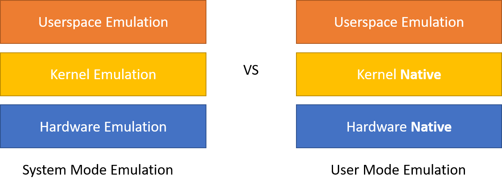

+++
title =  "Raspbian on your laptop: QEMU"
date =  2020-04-20T23:45:41+08:00
draft = false
katex= false    # Enable / disable katex math rendering
enableUtterance = true
tags = [
    "Raspberry Pi",
    "Docker"
    # "Hugo" 
]
categories = [
    "Docker",
    "Raspberry Pi"
    # "themes",
    # "syntax",
]
series = ["Raspbian on your laptop"] #"Themes Guide"]
aliases = [] # ["migrate-from-jekyl"]
+++

## TLDR

[`raspbian`](https://hub.docker.com/r/choonkiatlee/raspbian) is a docker image that allows you to run a fast raspbian image built for ARM directly on your x86 desktop. Test it out here: 

```bash
docker run -it --rm choonkiatlee/raspbian:faithful
```

## Motivation

Recently, I've been very interested in running machine learning algorithms on edge devices such as the Raspberry Pi. 

Pytorch has released a new [JIT](https://pytorch.org/docs/stable/jit.html) compilation feature. As explained in the linked documentation:

> TorchScript is a way to create serializable and optimizable models from PyTorch code. Any TorchScript program can be saved from a Python process and loaded in a process where there is no Python dependency.

However, I could not find any pre-compiled pytorch wheels for my Raspberry Pi. Thus, I decided to compile my own wheels. However, the compilation process takes really long (>36 hours) and so I decided to try leverage my own computer (or an Azure VM) to do the job for me instead. 

## First steps: QEMU

I was first inspired by @nmilosev's article [https://nmilosev.svbtle.com/compling-arm-stuff-without-an-arm-board-build-pytorch-for-the-raspberry-pi](https://nmilosev.svbtle.com/compling-arm-stuff-without-an-arm-board-build-pytorch-for-the-raspberry-pi]). 

The gist of the solution is that we can use the QEMU emulator to run programs compiled for ARM on our own x86 host machine. Using the qemu-user programs, we can use QEMU in the `User Mode Emulation` operation mode. In this mode, QEMU can launch Linux processes compiled for one CPU (Raspberry Pi) on another CPU (x86_64 host), and will translate syscalls on the fly. This way, we are still interfacing with the native kernel in the same way as any native piece of software. 



This brings much benefits as we no longer have to emulate all the hardware, which is slow. We also do not need to emulate the kernel, which is where most of the emulation computation takes place. 

Once we've installed the QEMU user emulation software, we can run the Raspbian bash whilst mounting the Raspbian rootFS, which gives us a bash shell that for most intents and purposes mimics one running on the RPI!


## Now for some code...

The following instructions have been adapted from the very good tutorial [here!](https://wiki.debian.org/RaspberryPi/qemu-user-static)

1) Install the QEMU emulation software

    ```bash
    # First, install the QEMU software
    sudo apt-get update && sudo apt-get install  -y --no-install-recommends qemu binfmt-support qemu-user-static
    ```

2) Mount or create a raspbian filesystem. You can either create a minimal rootfs from scratch using debootstrap or mount a pre-created raspbian image (eg: from the Raspberry Pi Foundation release).

    ```bash
    # 1. Create a minimal rootfs from scratch
    mkdir ~/rpi_mnt

    wget --no-check-certificate https://archive.raspbian.org/raspbian.public.key -O - | sudo apt-key add -q

    sudo qemu-debootstrap --variant='minbase' 
                    --keyring=/etc/apt/trusted.gpg \
                    --include=python3,git,python3-pip \
                    --arch armhf buster ~/rpi_mnt http://archive.raspbian.org/raspbian 
    ```

    Or 

    ```bash
    # 2. Mount an existing Raspbian Image
            
    # (Optional) Download the official Raspbian Image
    wget https://downloads.raspberrypi.org/raspbian_lite_latest
    unzip raspbian_lite_latest

    # Generate variables
    RPI_IMG_FILENAME=`unzip -Z -1 raspbian_lite_latest`
    LOOP_DEVICE=`sudo losetup -f`     # Find the name of the created loop device                      

    # Create a loopback device and mount it
    mkdir ~/rpi_mnt
    sudo losetup -f -P $RPI_IMG_FILENAME   
    sudo mount ${LOOP_DEVICE}p2 -o rw rpi_mnt
    ```

3) Prepare for chroot

    ```bash
    # Copy the quemu-arm-static binary into the image to be produced
    sudo cp /usr/bin/qemu-arm-static rpi_mnt/usr/bin

    # Backup /etc/ld.so.preload and remove it before chrooting in.
    sudo mv ~/rpi_mnt/etc/ld.so.preload ~/rpi_mnt/etc/ld.so.preload.backup
    sudo touch ~/rpi_mnt/etc/ld.so.preload

    # (Optional) -- Before chrooting in, mount device specific files from the host. Be careful though! Improper editing of these files can cause your host system to crash
    # mount --bind /dev ~/rpi_mnt/dev/
    # mount --bind /sys ~/rpi_mnt/sys/
    # mount --bind /proc ~/rpi_mnt/proc/
    # mount --bind /dev/pts ~/rpi_mnt/dev/pts
    ```

4) Actually chroot in.

    ```bash
    # Preferably, use systemd-nspawn instead if your host system uses systemd. This is best practice and does a better job of islating the chroot environment from your host system

    sudo apt-get install systemd-container
    systemd-nspawn -D ~/rpi_mnt bin/bash
    ```
    Or

    ```bash
    # Alternatively, chroot in
    chroot . ~/rpi_mntbin/bash    

    # Success! 
    uname -a
    ```

This is extremely useful, and allows you to easily edit and test your distribution before you burn it to an SD card for the RPi! 

However, this involves a lot of steps, and is hard to automate. In the next post, we will discuss how to create a docker container using the principles listed here to create our Raspbian docker image!

---
References:
- https://wiki.debian.org/RaspberryPi/qemu-user-static
- https://nmilosev.svbtle.com/compling-arm-stuff-without-an-arm-board-build-pytorch-for-the-raspberry-pi
- https://www.cnblogs.com/pengdonglin137/p/5020143.html#_lab2_0_0

