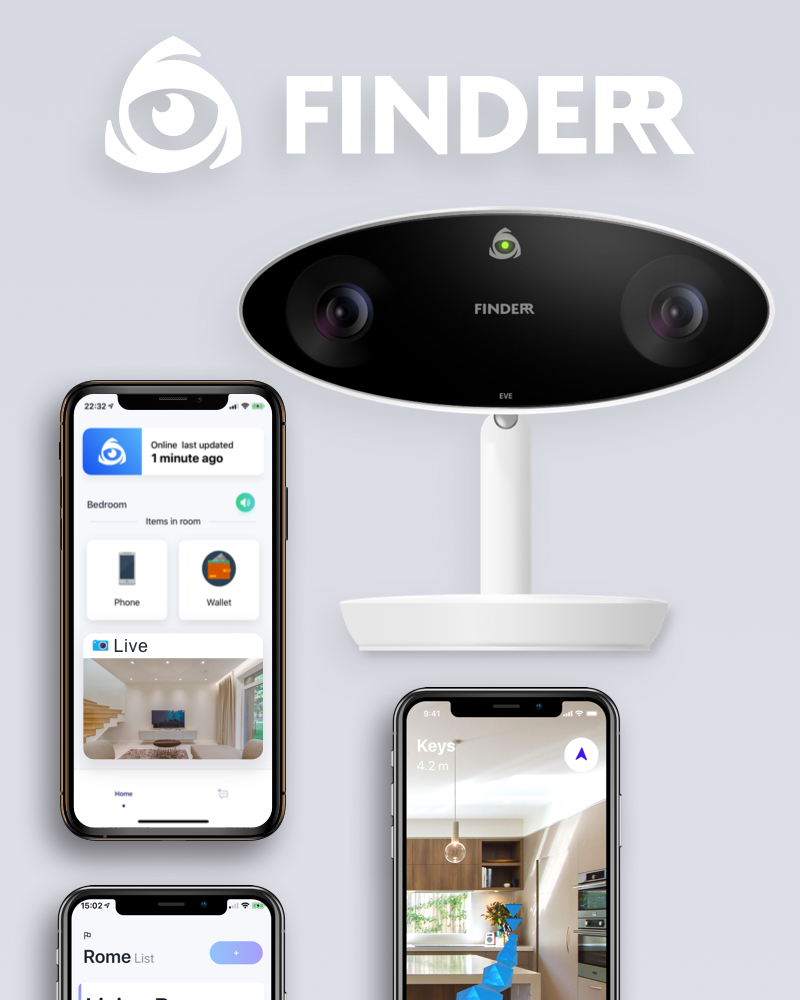

+++
title =  "Finderr"
date =  2020-04-21T04:03:11+08:00
draft = false
katex= false    # Enable / disable katex math rendering
tags = [
    # "Hugo" 
]
categories = [
    # "themes",
    # "syntax",
]
series = [] #["Themes Guide"]
aliases = [] # ["migrate-from-jekyl"]
+++

## TLDR: 

Empowering visually impaired users to live independent lives by allowing them to find their lost items. Consists of an image recognition system connected to a real time database and an AR-enabled iOS application to guide users to the item locations. 

__Check out our website [here](https://finderr.cf)__

## Press: 



  

    
    
    
  



<!-- |  | | |
|:--:|:--:|:--:| -->

