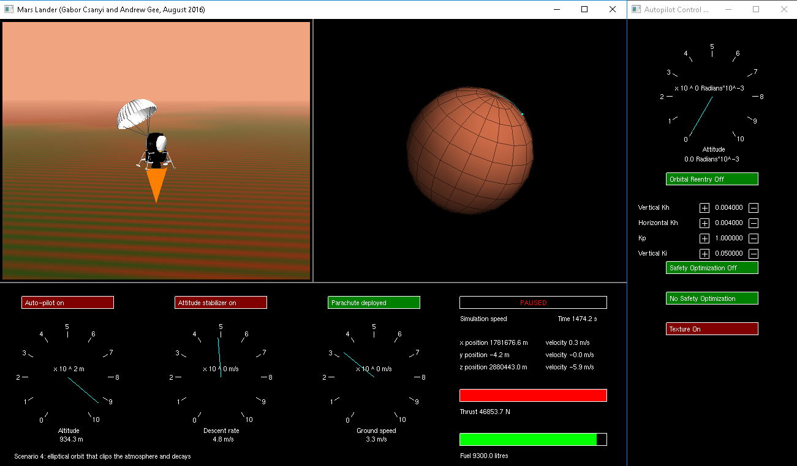

+++
title =  "Mars Lander"
date =  2020-04-21T01:38:28+08:00
draft = false
katex= false    # Enable / disable katex math rendering
tags = [
    # "Hugo" 
]
categories = [
    # "themes",
    # "syntax",
]
series = [] #["Themes Guide"]
aliases = [] # ["migrate-from-jekyl"]
+++

Wrote a program that simulates the dynamics of a spacecraft and implemented a robust autopilot that could cope with high lag in the system

This was implemented in C++ with OpenGl

